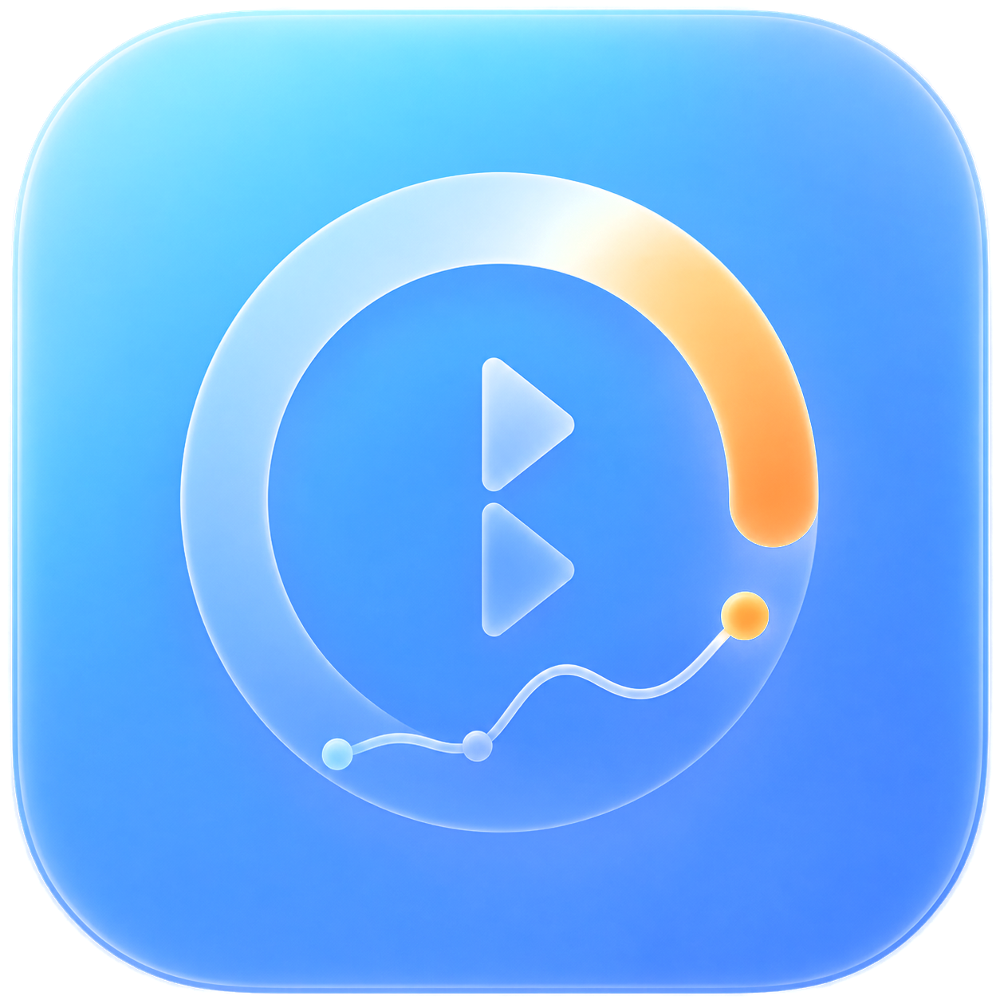

<p align="center">
  
</p>

# switchbot-home

Temperature/humidity monitoring for SwitchBot Meter Plus BLE sensors. A
single Rust backend scans BLE advertisements directly from each sensor
(no SwitchBot Hub or cloud account involved), stores the readings, and
serves them over a REST API. A macOS menu-bar client consumes that API; a
web app is planned.

## Project structure

```
switchbot-home/
├── Cargo.toml     # workspace
├── backend/       # BLE collector + REST API + SQLite storage (implemented)
├── macos-app/     # Swift/SwiftUI menu-bar client (implemented)
├── web-app/       # browser client — not started
├── scripts/       # one-liner install scripts (see Install below)
├── deploy/        # systemd unit, Dockerfile, k3s manifests
├── .github/       # CI: auto-deploy to the maintainer's homelab on push to main
└── docs/
    ├── progression.md   # running development log
    └── specs/            # design/architecture docs
```

For the system architecture and design decisions, see
[`docs/specs/architecture.md`](docs/specs/architecture.md). For agent
workflow rules, see [`CLAUDE.md`](CLAUDE.md).

## Install

One command each, building from source (see
[`docs/specs/installation-and-deployment.md`](docs/specs/installation-and-deployment.md)
for why: it sidesteps needing a release pipeline for the backend and
Gatekeeper/notarization for the macOS app entirely).

```
# Backend (Linux only — asks whether to install as a systemd service or
# a k3s deployment; installs Rust via rustup if it's missing)
curl -fsSL https://raw.githubusercontent.com/alehrs/switchbot-home/main/scripts/install-backend.sh | bash

# macOS menu-bar app (installs Homebrew/XcodeGen if missing, needs Xcode
# Command Line Tools — the script triggers that installer if it's missing,
# but its one-time GUI prompt on a brand new Mac can't be scripted around)
curl -fsSL https://raw.githubusercontent.com/alehrs/switchbot-home/main/scripts/install-macos-app.sh | bash
```

Already cloned the repo? `make install-backend` (or
`install-backend-systemd` / `install-backend-k3s` to skip the prompt) and
`make install-macos-app` call the same scripts.

**Backend config after install**: systemd →  edit
`/etc/switchbot-home/backend.env` then `systemctl restart
switchbot-home-backend`; k3s → edit `deploy/k3s/10-configmap.yaml`,
`kubectl apply` it, then `kubectl rollout restart
deployment/switchbot-home-backend -n switchbot-home`. Same env vars
either way — see below.

The k3s path needs BLE reachable from inside a container (`hostNetwork` +
the host's D-Bus socket mounted in) — see
[`docs/specs/installation-and-deployment.md`](docs/specs/installation-and-deployment.md) §7
for exactly what that requires and what's still unverified on real
cluster hardware.

## Backend: build, run, test

```
cargo build             # whole workspace
cargo test              # unit + storage + API tests, no hardware needed
cargo run -p backend    # starts the BLE scanner + HTTP API on :3000
cargo clippy --all-targets
cargo fmt --all
```

Configuration is via environment variables, all optional:

- `DATABASE_URL` — SQLite connection string (default:
  `sqlite://switchbot-home.sqlite`, created if missing).
- `BIND_ADDRESS` — HTTP listen address (default: `0.0.0.0:3000`).
- `READING_INTERVAL_SECONDS` — minimum seconds between two stored readings
  *per device*. Meter Plus broadcasts every few seconds, so without this
  every one of those gets stored. E.g. `30` stores at most one reading
  every 30 seconds per sensor. Default (unset): no throttling, every
  advertisement that parses is stored.
- `RETENTION_DAYS` — days of readings to keep; older ones are deleted
  automatically (checked hourly). E.g. `300` keeps roughly the last 300
  days. Default (unset): readings are never deleted.
- `BLE_ADAPTER` — which Bluetooth adapter to scan on, when the host has
  more than one. Matched as a substring of the adapter's info string
  (e.g. `hci1 (usb:v2357p0604d…)`), so either an `hciN` name (`hci1`) or
  a USB modalias fragment (`v2357p0604`) works; the modalias form is
  recommended since it survives `hciN` renumbering across reboots.
  Default (unset): the first adapter found.

### BLE scanning

Requires a Bluetooth adapter. On macOS you also need to grant Bluetooth
permission to your terminal app once: System Settings → Privacy &
Security → Bluetooth → add your terminal. Without it, `btleplug` silently
finds no devices.

The scanner supervises itself: BlueZ ends the advertisement stream
without an error whenever the adapter is reset (USB re-plug, `bluetoothd`
restart), so it reconnects automatically with backoff rather than going
quiet until the process is restarted. With multiple adapters, pin one
with `BLE_ADAPTER` (above) — otherwise the choice is not stable across
restarts.

To debug the parser against a real device, run with debug logging enabled:

```
RUST_LOG=debug cargo run -p backend
```

This logs every raw SwitchBot advertisement seen
(`backend/src/ble/switchbot.rs` parses the SwitchBot Meter/Meter Plus BLE
service-data format).

### REST API

```
GET  /devices                          list all devices (including blacklisted)
PUT  /devices/{device_id}               partial update: label, room, blacklisted
GET  /devices/{device_id}/latest        latest reading for one device
GET  /devices/{device_id}/readings      historical readings (?from=&to=, default: last 24h)
GET  /readings/latest                   latest reading per device, excluding blacklisted ones
```

Devices are auto-discovered: the first BLE advertisement from a sensor
creates its entry with `label = null`. Label it, assign it a room, or
blacklist it (to make the collector ignore it) via `PUT
/devices/{device_id}`.

[`backend/api.http`](backend/api.http) has ready-to-run requests for every
endpoint (VS Code "REST Client" extension or the JetBrains HTTP Client).

## macOS app: build, run, test

A menu-bar app (no Dock icon) showing every registered device grouped by
room, with a 1h average and a rising/falling trend indicator for
temperature and humidity. See
[`docs/specs/macos-app.md`](docs/specs/macos-app.md) for the full design.

The Xcode project is generated from [`macos-app/Project.yml`](macos-app/Project.yml)
via [XcodeGen](https://github.com/yonaskolb/XcodeGen) (`brew install
xcodegen`) — regenerate it after adding/removing Swift files:

```
cd macos-app
xcodegen generate
```

**Run it:**

```
open macos-app/SwitchBotHome.xcodeproj
```

In Xcode, pick **My Mac** as the run destination and press `Cmd+R`. No
Apple Developer account is needed — Xcode signs it "to run locally"
automatically. There's no Dock icon; look for a thermometer icon in the
menu bar (near the clock) and click it to open the popover. Quit via the
**Quit** button inside the popover (there's no Dock icon to right-click).

The backend must be running first (`cargo run -p backend`) for the app to
show data. If it's not on `http://localhost:3000`, open **Settings…**
from the popover to point the app at a different URL — it has a "Test
Connection" button and takes effect immediately, no restart needed. If
you enter a LAN IP instead of `localhost`, macOS may prompt for "local
network access" — allow it.

**Build and test from the command line** (no Xcode GUI needed):

```
cd macos-app
xcodebuild -project SwitchBotHome.xcodeproj -scheme SwitchBotHome -destination 'platform=macOS' build CODE_SIGNING_ALLOWED=NO
xcodebuild -project SwitchBotHome.xcodeproj -scheme SwitchBotHome -destination 'platform=macOS' test CODE_SIGNING_ALLOWED=NO
```

The 26 unit tests (`macos-app/SwitchBotHomeTests/`) cover the pure logic
— device numbering, room grouping, trend calculation, JSON decoding — and
need no backend or network access. UI/networking behavior (does the
popover render correctly, does it recover after the backend restarts) can
only be verified by actually running the app against a live backend.
